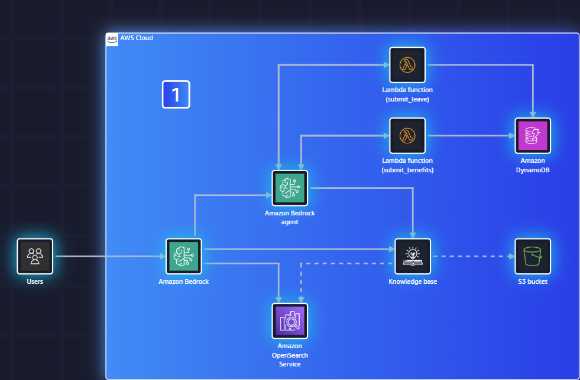

# AI Smart Assistant — AWS Cloud Club Workshop

An AI-powered HR Smart Assistant built on **Amazon Bedrock**, designed to automate employee inquiries about policies, benefits, and procedures.

Built during the **AWS Cloud Club Workshop** at UNC Charlotte (March 2026) using the AWS SimuLearn platform.

## Problem Statement

An HR department is overwhelmed by **500+ daily employee requests** covering policies, benefits, and procedures. Current limitations include:

- Responses restricted to business hours only
- Limited capacity for simultaneous replies
- No automated or self-service option for employees

## Solution

An AI Smart Assistant powered by Amazon Bedrock that provides **24/7 automated responses** to common HR inquiries, freeing up the HR team to focus on complex cases.

## Architecture

### How It Works

1. **Users** send queries to **Amazon Bedrock**, which routes them to a **Bedrock Agent** for orchestration.

2. The **Bedrock Agent** determines intent and takes one of two paths:

   - **Action Groups (Lambda)** — For transactional requests, the agent invokes Lambda functions:
     - `submit_leave` — Processes employee leave requests and writes to **DynamoDB**
     - `submit_benefits` — Handles benefits enrollment/inquiries and writes to **DynamoDB**

   - **Knowledge Base (RAG)** — For policy and procedure questions, the agent queries a **Knowledge Base** backed by **Amazon OpenSearch Service** for vector search, which retrieves relevant HR documents stored in an **S3 bucket**.

## AWS Services Used

| Service | Purpose |
|---------|---------|
| **Amazon Bedrock** | Foundation model hosting and agent orchestration |
| **Amazon Bedrock Agent** | Intent routing, action group execution, and knowledge base queries |
| **AWS Lambda** | Backend logic for `submit_leave` and `submit_benefits` action groups |
| **Amazon DynamoDB** | Storage for leave requests and benefits data |
| **Amazon OpenSearch Service** | Vector search engine for knowledge base retrieval |
| **Amazon S3** | Storage for HR policy documents used by the knowledge base |

## What I Learned

- Setting up an **Amazon Bedrock Agent** with knowledge bases for retrieval-augmented generation (RAG)
- Connecting **knowledge bases** to S3-hosted documents so the agent can answer policy questions accurately
- Adding **action groups** with specific Lambda functions (`submit_leave`, `submit_benefits`) to handle transactional workflows
- Using **OpenSearch Service** as the vector store for semantic document search
- Using **DynamoDB** for structured data storage behind action groups

### Key Setup Steps

1. **Enable Bedrock model access** in the AWS Console for your chosen foundation model
2. **Create an S3 bucket** and upload HR policy documents
3. **Set up OpenSearch Service** as the vector store
4. **Create a Bedrock Knowledge Base** pointing to S3 with OpenSearch as the backend
5. **Create Lambda functions** for `submit_leave` and `submit_benefits`
6. **Configure DynamoDB tables** for leave and benefits records
7. **Create a Bedrock Agent** with action groups linked to Lambda and the knowledge base attached
8. **Test the agent** in the Bedrock console playground

## Acknowledgments

- **AWS Cloud Club at UNC Charlotte** for hosting the workshop
- **AWS SimuLearn** for the hands-on learning platform
