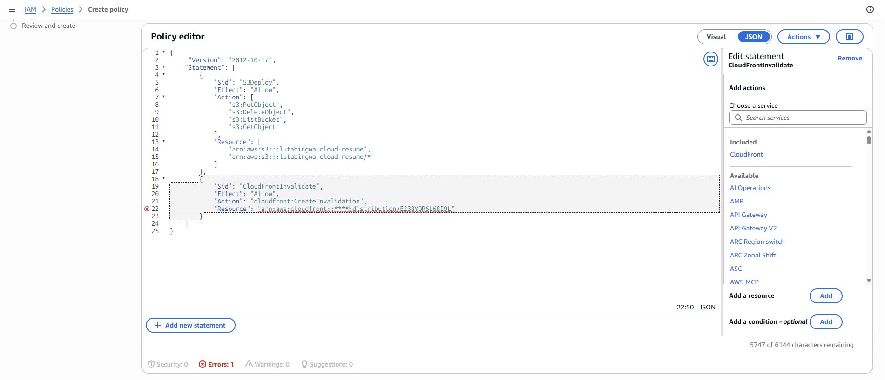
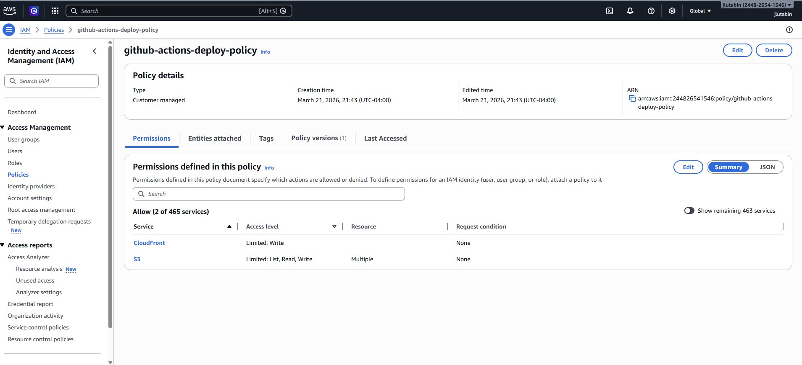
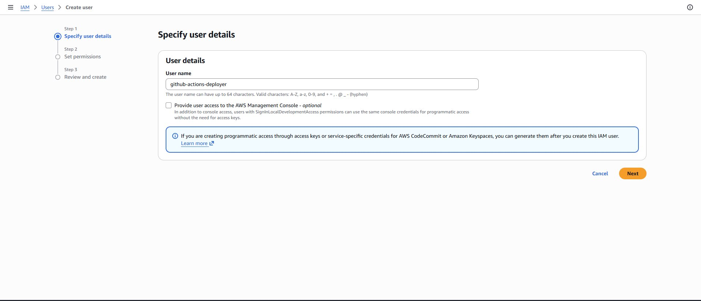
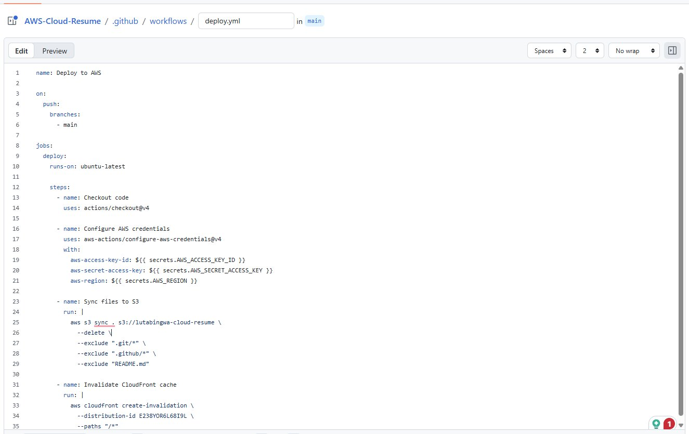
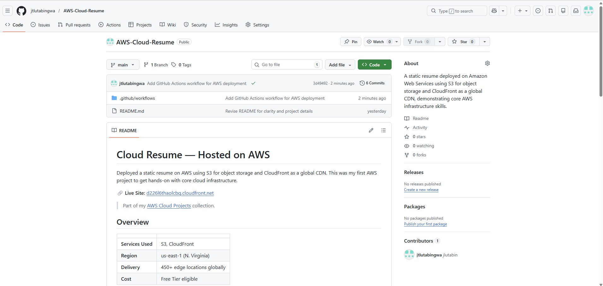
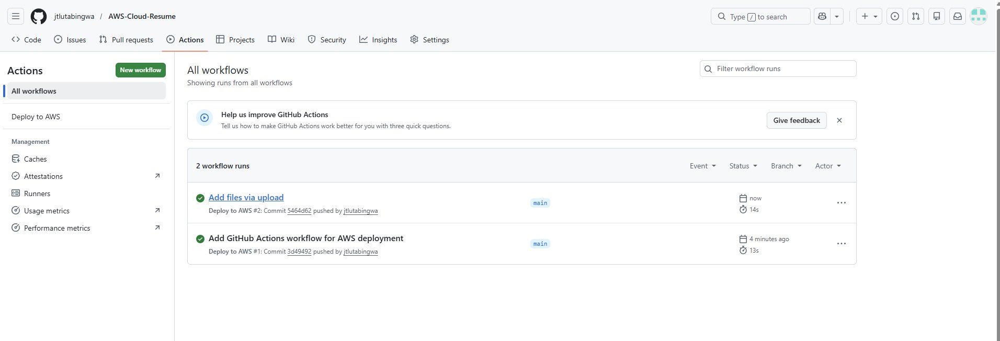
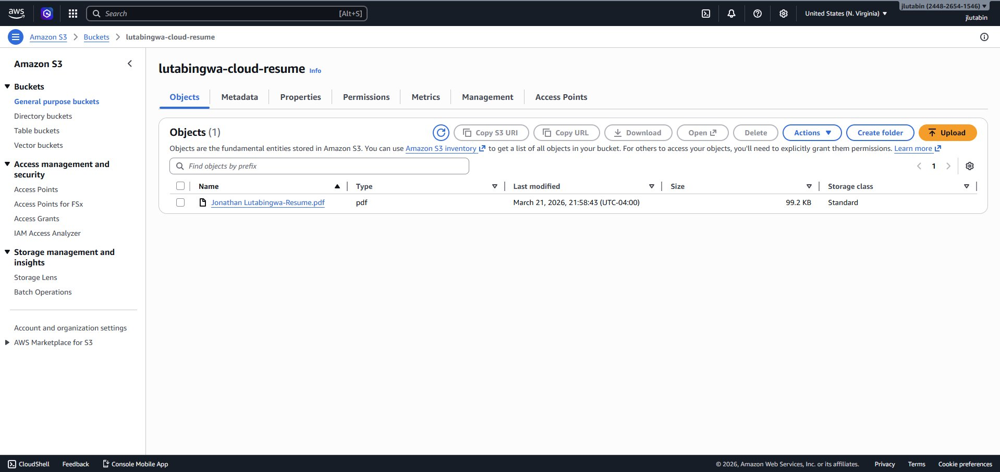
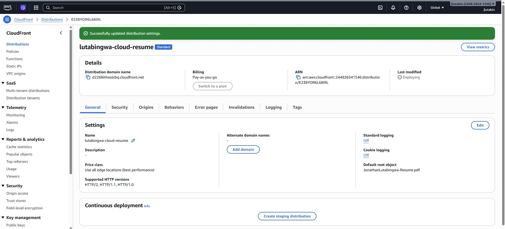
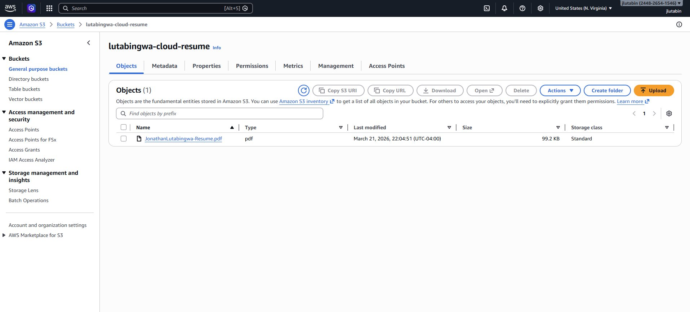

# CI/CD Pipeline — GitHub Actions to AWS
 
Set up a CI/CD pipeline using GitHub Actions that automatically deploys my Cloud Resume to S3 and invalidates the CloudFront cache on every push to `main`. No more manual uploads — just push and it's live.
 
> This pipeline automates the deployment for my [Cloud Resume](https://github.com/jtlutabingwa/AWS-Cloud-Resume) project.
 
## Overview
 
| | |
|---|---|
| **Services Used** | GitHub Actions, IAM, S3, CloudFront |
| **Trigger** | Push to `main` branch |
| **Pipeline Steps** | Checkout → Sync to S3 → Invalidate CloudFront |
| **Cost** | Free |

 ## Key Concepts
 
| Concept | What It Is |
|---|---|
| **CI/CD** | Continuous Integration / Continuous Deployment — automatically deploy code on every push |
| **GitHub Actions** | GitHub's built-in automation platform that runs workflows on repo events |
| **Workflow** | A YAML file defining steps to execute (checkout, deploy, invalidate, etc.) |
| **GitHub Secrets** | Encrypted variables for passing credentials to workflows securely |
| **IAM User** | An identity with programmatic access keys for service-to-service authentication |
| **Least Privilege** | Security principle — grant only the minimum permissions needed |
| **S3 Sync** | Mirrors local files to S3, uploading new/changed files and deleting removed ones |
| **Cache Invalidation** | Forces CloudFront to drop cached content and fetch fresh files from the origin |

## Architecture
 
```
Developer pushes to GitHub
         │
         ▼
┌─────────────────────┐
│   GitHub Actions    │
│                     │
│   1. Checkout code  │
│   2. Sync to S3     │
│   3. Invalidate     │
│      CloudFront     │
└─────────┬───────────┘
          │
    ┌─────┴─────┐
    ▼           ▼
┌────────┐  ┌────────────┐
│   S3   │  │ CloudFront │
│ Bucket │  │   Cache    │
└────────┘  └────────────┘
          │
          ▼
    Updated site is live
```
 
## What I Did
 
### Created a Least-Privilege IAM Policy
 
Wrote a custom IAM policy called `github-actions-deploy-policy` that only grants access to my specific S3 bucket and CloudFront distribution — nothing else. Two permission blocks: S3 for uploading files, and CloudFront for cache invalidation.
 

 
The policy summary confirms it only touches 2 services with limited access:
 

 
### Created a Dedicated IAM User
 
Created `github-actions-deployer` — a service account specifically for the pipeline. No console access, just programmatic access keys. Attached the custom policy so it can only do what the pipeline needs.
 

 
### Stored Credentials in GitHub Secrets
 
Added `AWS_ACCESS_KEY_ID`, `AWS_SECRET_ACCESS_KEY`, and `AWS_REGION` as encrypted repository secrets. The workflow references them at runtime but they're never exposed in logs or code.
 
### Wrote the GitHub Actions Workflow
 
Created `.github/workflows/deploy.yml` — triggers on every push to `main`. Four steps: checkout the code, authenticate with AWS using the secrets, sync files to S3 (excluding git files and the README), and invalidate the CloudFront cache.
 

 
### Tested the Pipeline
 
Pushed the workflow and the resume to the repo. Both commits triggered the pipeline and completed successfully:
 

 

 
### Verified the Deployment
 
The first pipeline run synced the resume with the original filename to S3:
 

 
Updated the CloudFront default root object to match the filename:
 

 
Renamed the file to remove spaces (cleaner URLs), pushed again, and the pipeline automatically synced the updated file:
 

 
## What I Learned
 
- CI/CD eliminates manual deployments — push to `main` and the pipeline handles the rest
- IAM policies should follow least privilege — only grant the exact permissions the pipeline needs
- GitHub Secrets keep credentials encrypted and out of source code
- `aws s3 sync --delete` mirrors the repo to S3, including removing files that were deleted locally
- CloudFront cache invalidation is necessary after deployment, otherwise users get stale content
- Filenames with spaces cause issues in URLs — always use clean names for deployed assets
