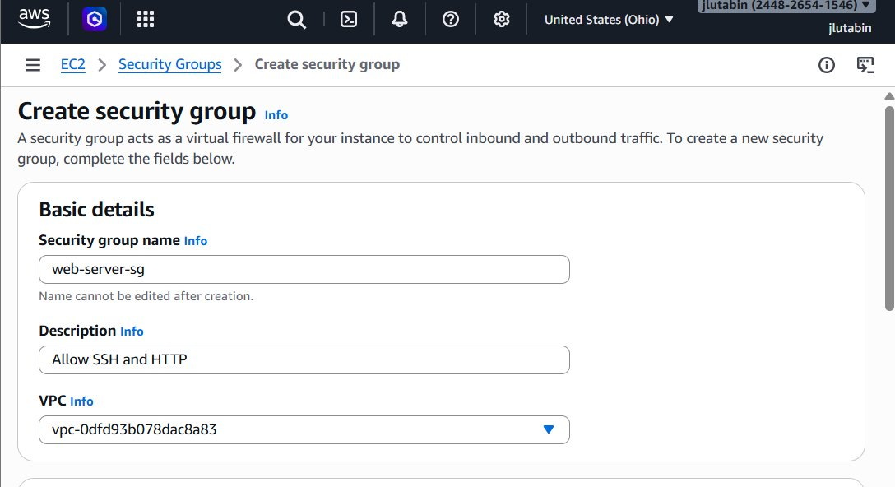
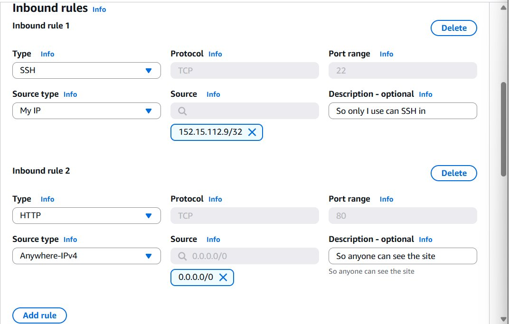
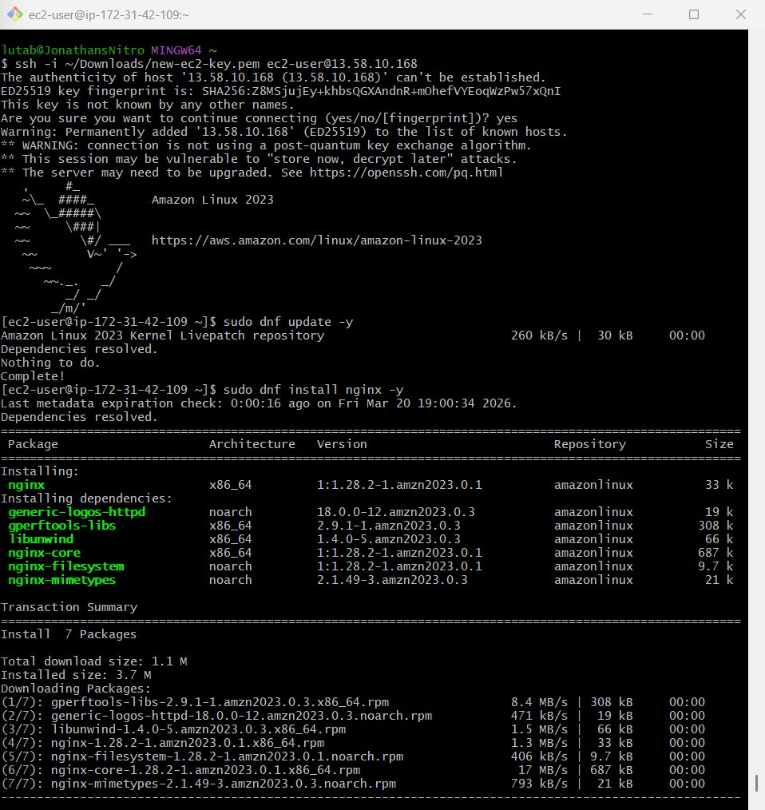
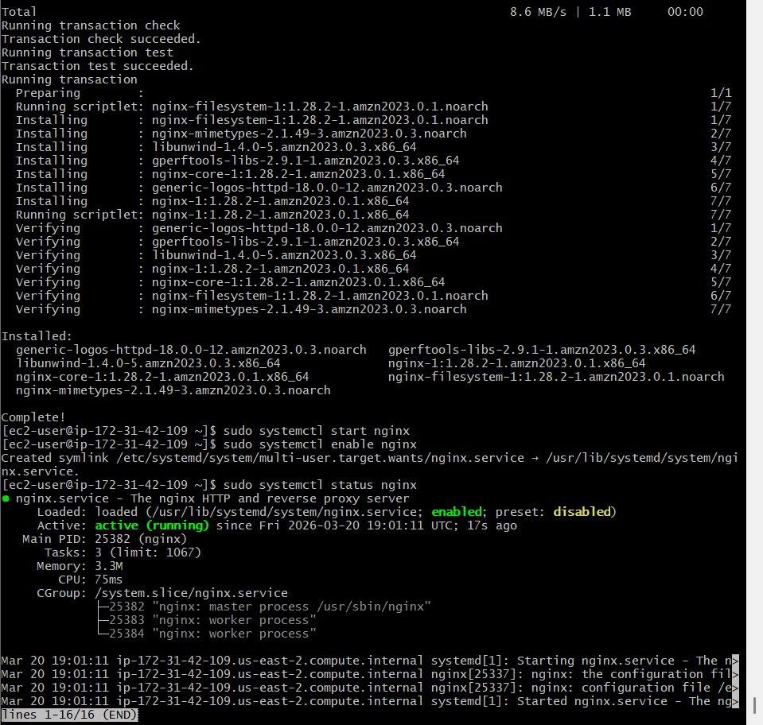
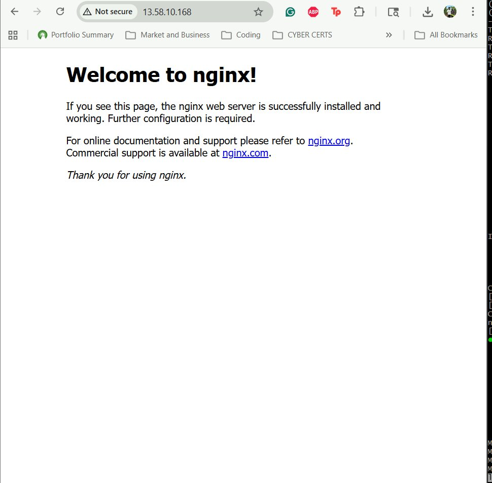
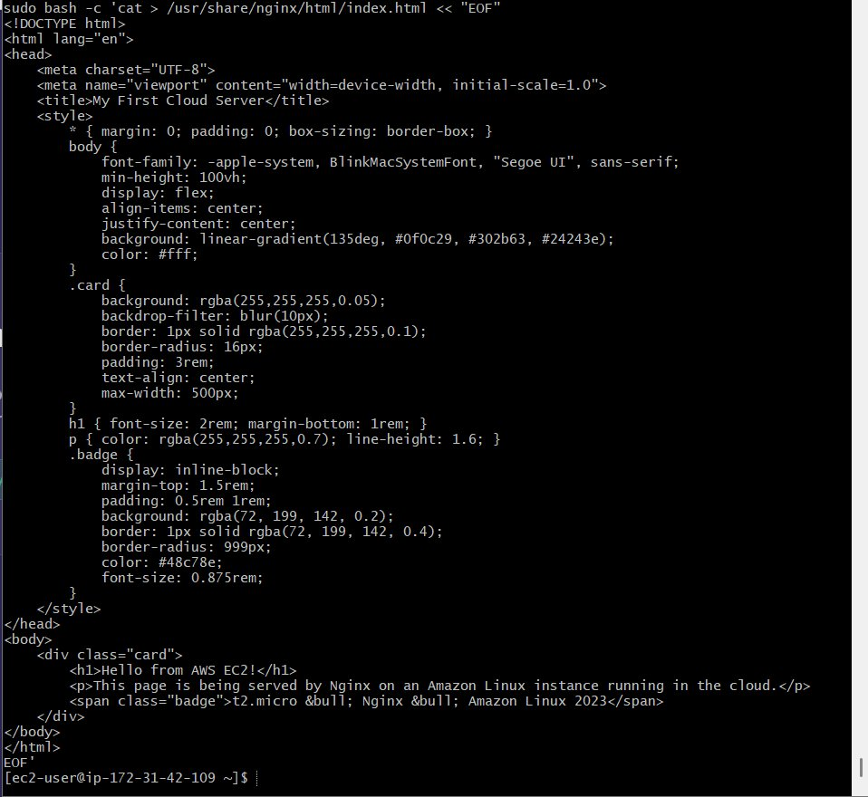
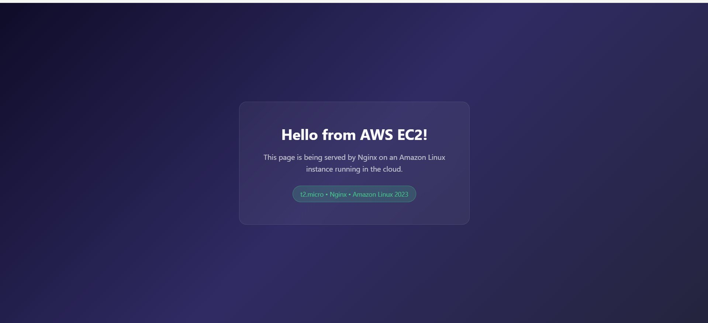

# EC2 Web Server
 
Deploy a custom web page to the internet using an AWS EC2 instance and Nginx.
 
## Overview
 
| | |
|---|---|
| **Services** | EC2, VPC, Security Groups |
| **Difficulty** | Beginner |
| **Time** | ~1.5–2 hours |
| **Cost** | Free Tier eligible |
 
## Architecture
 
```
User (Browser)
     │
     │  HTTP (port 80)
     ▼
┌──────────────┐
│  Security    │  ← allows port 22 (SSH, my IP only)
│  Group       │  ← Allows port 80 (HTTP, anywhere)
└──────┬───────┘
       ▼
┌──────────────┐
│  EC2         │
│  t2.micro    │
│              │
│  Amazon      │
│  Linux 2023  │
│              │
│  Nginx       │
│  Web Server  │
└──────────────┘
```
 
## What I Learned
 
- Launching and connecting to an EC2 instance via SSH
- Configuring Security Groups as cloud firewalls (inbound rules for SSH and HTTP)
- Installing and managing services with `systemctl` on Amazon Linux
- Deploying a static web page with Nginx
- Key pair authentication for remote access
 
---
 
## Step-by-Step Walkthrough
 
### 1. Create a Key Pair
 
Go to **EC2 → Key Pairs → Create key pair**. Name it and select `.pem` format. This file is your SSH private key — keep it safe and restrict permissions:
 
```bash
chmod 400 ~/Downloads/my-ec2-key.pem
```
 
### 2. Create a Security Group
 
Go to **EC2 → Security Groups → Create security group**.
 
Set up the basic details — name it `web-server-sg` with a description, and leave the VPC as default:
 

 
Then add two inbound rules:
 
- **SSH (port 22)** — Source: My IP (so only you can connect)
- **HTTP (port 80)** — Source: Anywhere-IPv4 (so anyone can view the site)
 

 
### 3. Launch the EC2 Instance
 
Go to **EC2 → Launch instance** and configure:
 
- **AMI:** Amazon Linux 2023 (free tier eligible)
- **Instance type:** `t2.micro` (1 vCPU, 1 GB RAM — free tier)
- **Key pair:** Select the key you just created
- **Security group:** Select `web-server-sg`
- **Storage:** 8 GB gp3 (default)
 
Click **Launch instance** and wait for the state to show **Running**.
 
### 4. SSH into the Instance
 
Grab the public IP from the EC2 console and connect:
 
```bash
ssh -i ~/Downloads/my-ec2-key.pem ec2-user@<YOUR_PUBLIC_IP>
```
 

 
### 5. Install and Start Nginx
 
```bash
sudo dnf update -y
sudo dnf install nginx -y
sudo systemctl start nginx
sudo systemctl enable nginx
sudo systemctl status nginx
```
 
You should see Nginx active and running:
 

 
Open `http://<YOUR_PUBLIC_IP>` in a browser to confirm the default welcome page:
 

 
### 6. Deploy a Custom Page
 
Replace the default Nginx page with a custom HTML page:
 
```bash
sudo bash -c 'cat > /usr/share/nginx/html/index.html << "EOF"
<!DOCTYPE html>
<html lang="en">
<head>
    <meta charset="UTF-8">
    <meta name="viewport" content="width=device-width, initial-scale=1.0">
    <title>My First Cloud Server</title>
    <style>
        * { margin: 0; padding: 0; box-sizing: border-box; }
        body {
            font-family: -apple-system, BlinkMacSystemFont, "Segoe UI", sans-serif;
            min-height: 100vh;
            display: flex;
            align-items: center;
            justify-content: center;
            background: linear-gradient(135deg, #0f0c29, #302b63, #24243e);
            color: #fff;
        }
        .card {
            background: rgba(255,255,255,0.05);
            backdrop-filter: blur(10px);
            border: 1px solid rgba(255,255,255,0.1);
            border-radius: 16px;
            padding: 3rem;
            text-align: center;
            max-width: 500px;
        }
        h1 { font-size: 2rem; margin-bottom: 1rem; }
        p { color: rgba(255,255,255,0.7); line-height: 1.6; }
        .badge {
            display: inline-block;
            margin-top: 1.5rem;
            padding: 0.5rem 1rem;
            background: rgba(72, 199, 142, 0.2);
            border: 1px solid rgba(72, 199, 142, 0.4);
            border-radius: 999px;
            color: #48c78e;
            font-size: 0.875rem;
        }
    </style>
</head>
<body>
    <div class="card">
        <h1>Hello from AWS EC2!</h1>
        <p>This page is being served by Nginx on an Amazon Linux instance running in the cloud.</p>
        <span class="badge">t2.micro &bull; Nginx &bull; Amazon Linux 2023</span>
    </div>
</body>
</html>
EOF'
```
 

 
Refresh the browser to see the custom page live:
 

 
---
 
## Cleanup
 
To avoid charges, tear down resources when done:
 
1. **Terminate the instance:** EC2 → Instances → select → Instance State → Terminate
2. **Release Elastic IP** (if created): EC2 → Elastic IPs → select → Actions → Release
3. **Delete Security Group:** EC2 → Security Groups → delete `web-server-sg`
4. **Delete Key Pair:** EC2 → Key Pairs → delete your key
 
> **Tip:** You can also just **stop** the instance if you want to come back to it later. You'll still pay for EBS storage, but it's free-tier eligible (up to 30 GB for 12 months).
 
## Key Concepts
 
| Concept | Description |
|---|---|
| **EC2** | Elastic Compute Cloud — virtual machines in AWS |
| **AMI** | Amazon Machine Image — the OS template for your instance |
| **t2.micro** | A small, free-tier-eligible instance type (1 vCPU, 1 GB RAM) |
| **Key Pair** | Public/private key used for SSH authentication |
| **Security Group** | Virtual firewall controlling inbound/outbound traffic |
| **Nginx** | Lightweight, high-performance web server |
