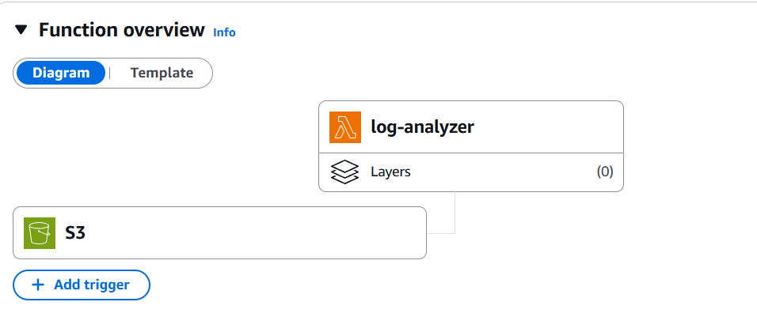
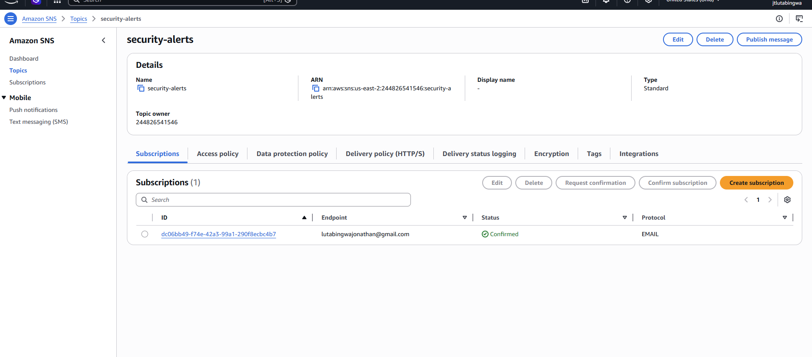
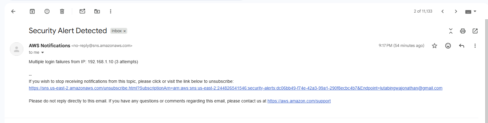

# 🚨 AWS Log Monitoring & Alert System

A serverless security monitoring system built on AWS that detects suspicious login activity and sends real-time alerts.

This project simulates a **Security Operations Center (SOC)** workflow by analyzing authentication logs, detecting brute-force login attempts, and notifying administrators automatically.

---

# 📌 Project Overview

This system automatically analyzes uploaded log files and detects suspicious activity such as repeated failed login attempts.

When a log file is uploaded:

1. Logs are uploaded to **Amazon S3**
2. **AWS Lambda** processes the log
3. Failed login attempts are analyzed
4. Suspicious IPs are detected
5. **Amazon SNS** sends email alerts

---

# 🏗️ Architecture Diagram


---

# 📸 Project Screenshots

## Lambda Function with S3 Trigger



---

## S3 Bucket with Uploaded Log


---

## SNS Topic Configuration



---

## Email Alert Received



---

# 🛠️ Technologies Used

- **AWS S3** — Log storage
- **AWS Lambda** — Serverless log analysis
- **AWS SNS** — Email alert notifications
- **Python** — Log parsing and detection logic
- **CloudWatch Logs** — Monitoring and debugging
- **Regex (re module)** — Pattern detection

---

# 🔍 Features

✅ Detects repeated failed login attempts  
✅ Identifies suspicious IP addresses  
✅ Sends automated email alerts  
✅ Uses serverless AWS architecture  
✅ Fully event-driven system  
✅ Real-time log analysis  

---

# 🧠 Detection Logic

The system detects brute-force login attempts by:

- Searching logs for:

```
Failed password
```

- Extracting IP addresses using regex
- Counting failed login attempts
- Triggering alerts when attempts exceed a threshold

Example threshold:

```python
THRESHOLD = 3
```

---

# 📂 Example Log File

Example `auth.log`:

```
Mar 10 10:15:01 server sshd[1234]: Failed password for invalid user admin from 192.168.1.10 port 22 ssh2
Mar 10 10:15:05 server sshd[1235]: Failed password for invalid user root from 192.168.1.10 port 22 ssh2
Mar 10 10:15:07 server sshd[1236]: Failed password for invalid user test from 192.168.1.10 port 22 ssh2
```

---

# ⚙️ Setup Instructions

## Step 1 — Create S3 Bucket

Create an S3 bucket:

```
soc-log-monitor-bucket-yourname
```

Upload log files into this bucket.

---

## Step 2 — Create Lambda Function

Runtime:

```
Python 3.11
```

Function name:

```
log-analyzer
```

Paste the Python log analyzer code into Lambda.

---

## Step 3 — Create SNS Topic

Create topic:

```
security-alerts
```

Add email subscription and confirm it.

---

## Step 4 — Connect S3 Trigger

Attach S3 trigger to Lambda:

```
Event type: PUT
```

---

## Step 5 — Test System

Upload:

```
auth.log
```

You should receive:

```
Security Alert Detected
Multiple login failures from IP: ...
```

---

# 📁 Project Structure

```
aws-log-monitoring-system/
│
├── lambda_function.py
├── sample_logs/
│   └── auth.log
│
├── images/
│   ├── lambda-overview.png
│   ├── lambda-s3-trigger.png
│   ├── s3-bucket.png
│   ├── sns-topic.png
│   └── email-alert.png
│
├── README.md
```

---

# 🔐 Security Concepts Demonstrated

- Brute-force detection
- Log parsing and monitoring
- Event-driven security pipelines
- Automated alerting systems
- Cloud-based threat detection
- Serverless security architecture

---

# 👨‍💻 Author

**Jonathan Lutabingwa**  
Cybersecurity & Cloud Engineering Student  
University of North Carolina at Charlotte  

---

# ⭐ Why This Project Matters

This project simulates a **real-world SOC detection pipeline** and demonstrates:

- Cloud engineering skills
- Security automation
- AWS serverless architecture
- Log analysis and monitoring

These are **core skills required for cloud and cybersecurity roles.**
