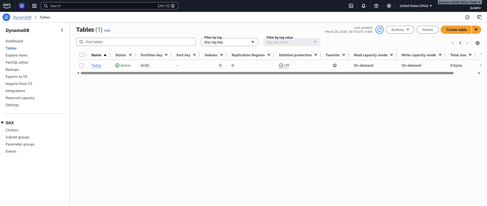
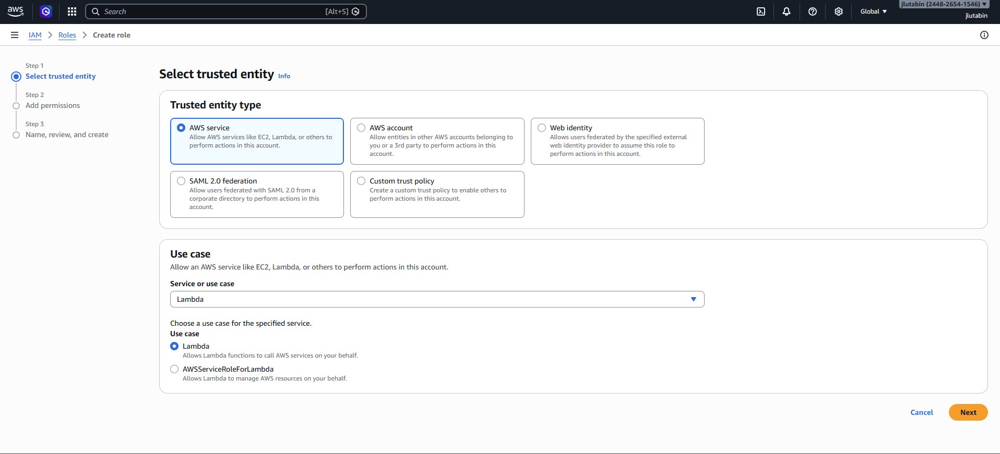
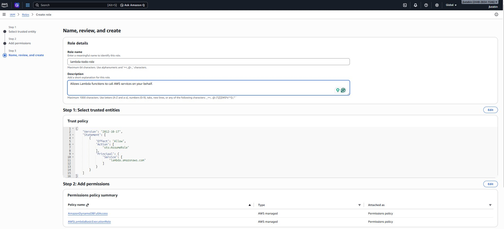
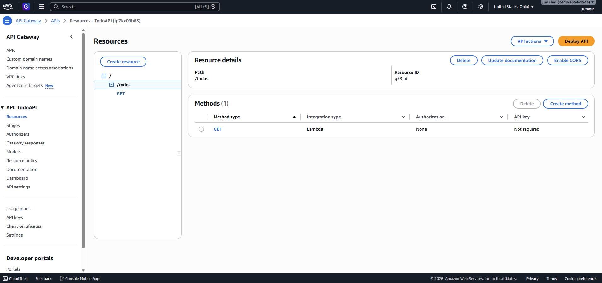
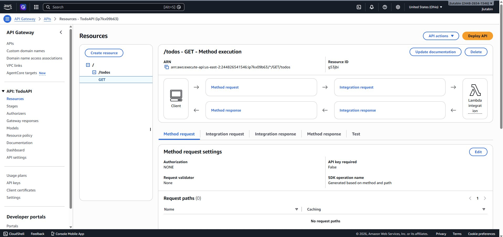
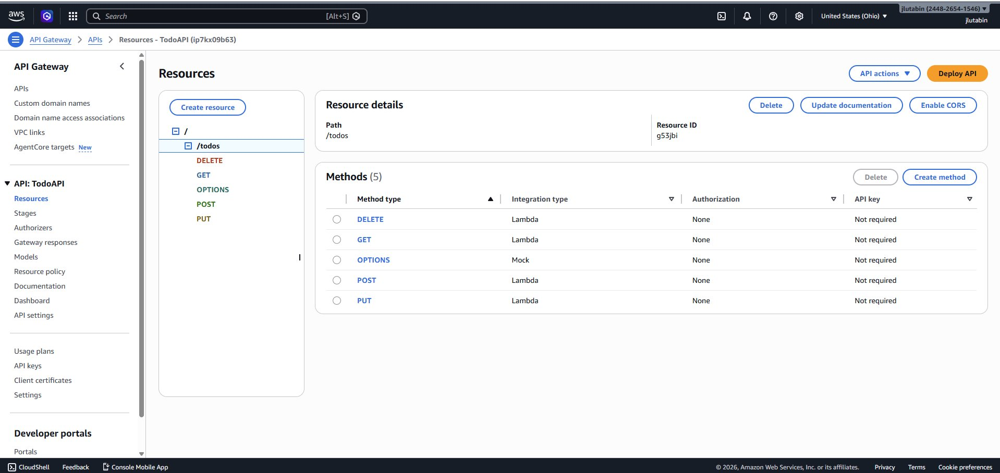
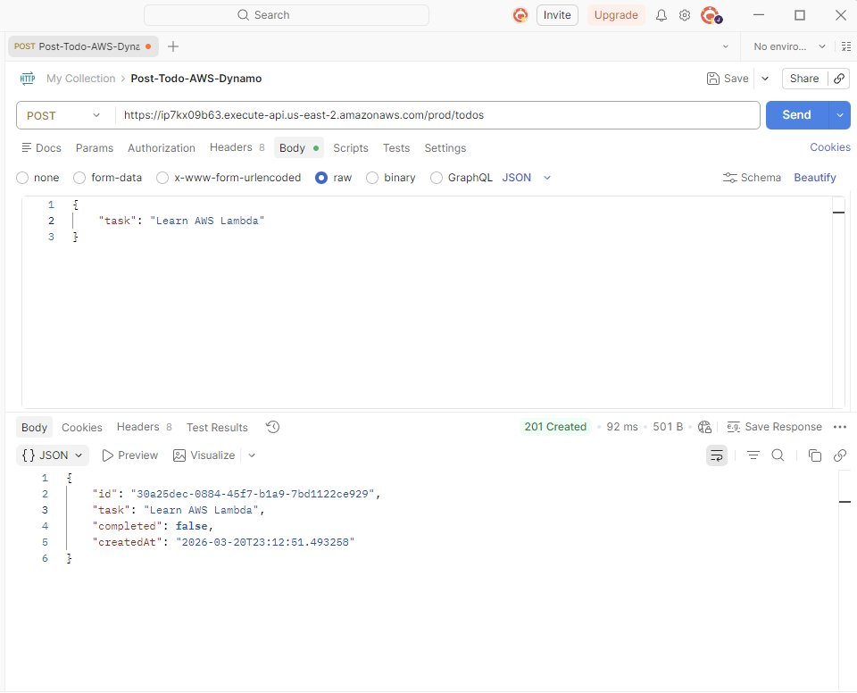
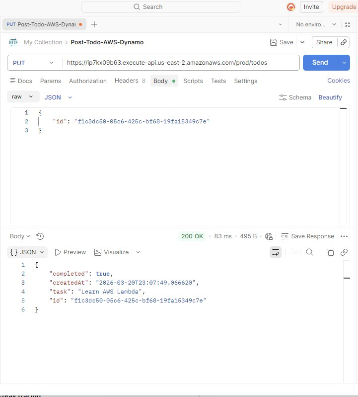
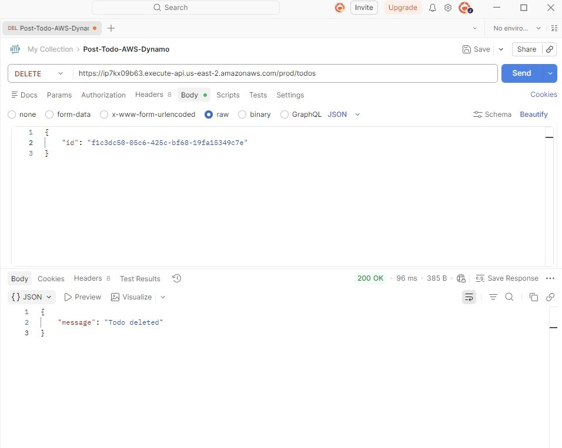

# Serverless To-Do List API
 
Built a fully serverless REST API on AWS using Lambda, API Gateway, and DynamoDB. No servers to manage — requests come in through API Gateway, trigger a Python Lambda function, and read/write to a DynamoDB table.
 
## Overview
 
| | |
|---|---|
| **Services Used** | Lambda, API Gateway, DynamoDB, IAM |
| **Runtime** | Python 3.12 |
| **Endpoints** | GET, POST, PUT, DELETE |
| **Cost** | Free Tier eligible |
 
## Architecture
 
```
Client (Postman/curl)
     │
     │  HTTPS
     ▼
┌──────────────────┐
│   API Gateway    │
│                  │
│  GET    /todos   │  → List all to-dos
│  POST   /todos   │  → Create a to-do
│  PUT    /todos   │  → Update a to-do
│  DELETE /todos   │  → Delete a to-do
└────────┬─────────┘
         ▼
┌──────────────────┐
│  Lambda Function │
│  (Python 3.12)   │
└────────┬─────────┘
         ▼
┌──────────────────┐
│  DynamoDB Table  │
│  (Todos)         │
└──────────────────┘
```
 
## What I Did
 
### Created the DynamoDB Table
 
Set up a `Todos` table with `id` (String) as the partition key and on-demand capacity mode.
 

 
### Created an IAM Role for Lambda
 
Created `lambda-todo-role` with `AmazonDynamoDBFullAccess` and `AWSLambdaBasicExecutionRole` policies so the Lambda function has permission to read/write to DynamoDB and log to CloudWatch.
 

 

 

 
### Wrote the Lambda Function
 
Single Python function that handles all four CRUD operations based on the HTTP method. The code is in [`lambda_function.py`](lambda_function.py).
 
Key things it does:
- Routes requests by checking `event['httpMethod']`
- Generates UUIDs for new to-do items
- Uses DynamoDB's `UpdateExpression` syntax for partial updates
- Returns consistent JSON responses with CORS headers
 
### Set Up API Gateway
 
Created a REST API with a `/todos` resource and wired up GET, POST, PUT, and DELETE methods — all pointing to the same Lambda function with Lambda Proxy Integration enabled.
 

 

 

 
### Tested with Postman
 
All four operations are working:
 
**POST** — Create a new to-do (201 Created):
 

 
**GET** — List all to-dos (200 OK):
 

 
**PUT** — Mark a to-do as completed (200 OK):
 

 
**DELETE** — Remove a to-do (200 OK):
 

 
## What I Learned
 
- How serverless architecture works — Lambda only runs when triggered, no idle servers
- API Gateway maps HTTP routes to Lambda and handles the public HTTPS endpoint
- DynamoDB is schema-less beyond the partition key, which makes it flexible for simple data
- IAM roles are how AWS services get permission to talk to each other
- Lambda Proxy Integration is required for API Gateway to pass the full HTTP request (method, body, headers) to Lambda
- The "Missing Authentication Token" error from API Gateway actually means the route doesn't exist, not an auth issue
